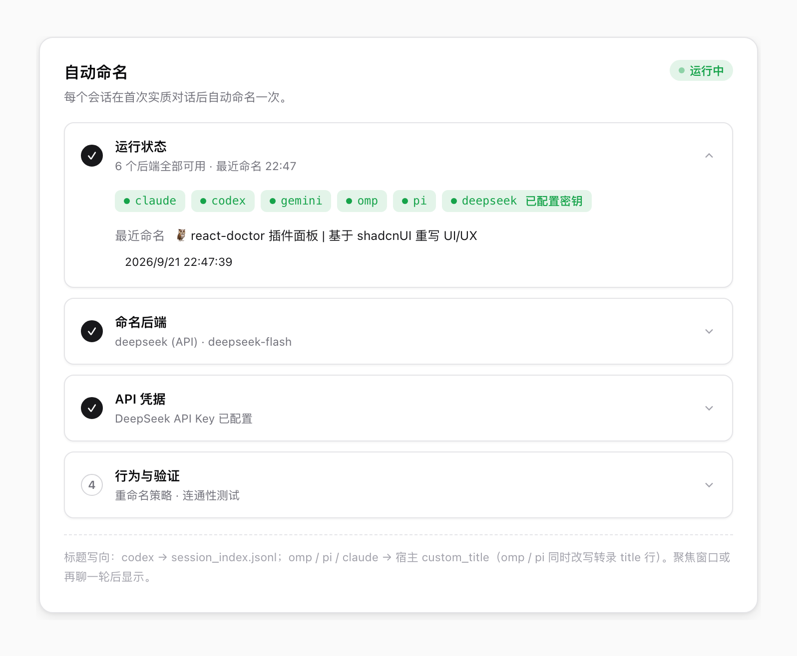

# auto-title — CC GUI 会话自动命名

参考 [oil-codex-title](https://github.com/oil-oil/oil-codex-title) 的思路，按 desktop-cc-gui 的实际架构重做：每轮对话结束后，用本机已登录的 CLI 模型生成「类别 emoji + 对象｜目标」标题（如 `🧩 邮箱验证码｜过期修复`），经各引擎可用的标题通道写入，宿主侧边栏/标签页在下一次扫描后显示。

## 界面

设置 → 插件 → 自动命名（引导步骤）：

| 浅色 | 深色 |
| --- | --- |
|  |  |

> 素材放在 `docs/`，由 `manifest.json` 的 `icon` / `screenshots` 声明，市场详情页
> 图集按默认分支直接读取——换图不需要发版。

## 支持的引擎与标题通道

| 引擎 | 转录位置 | 写入通道 |
|---|---|---|
| codex | `~/.codex/sessions/**` | 追加 `session_index.jsonl`（宿主 `codex_titles::sync` 扫描同步） |
| omp / pi | `~/.omp/agent/sessions/**` | 就地等长改写转录行首 `title` 行（pad 协议）+ 宿主 app.db `custom_title` |
| claude | `~/.claude/projects/**` | 宿主 app.db `custom_title`（claude 无引擎侧标题通道） |

侧栏与标签页显示 `customTitle || title`，所以 omp/pi/claude 写 `custom_title` 即生效；codex 走引擎官方命名存储。**你在宿主里手动改名的会话不会被覆盖**（插件检测到非自己写入的 custom_title 会让位并固定）。

## 工作方式

1. 宿主引擎事件桥把每轮结束的 `usage://updated` 发给插件（含 engine/sessionId），按会话防抖 8s 后串行评估。
2. 内嵌 python3 助手（`plugin_exec_run`）读取转录：最近 6 条用户消息 + 3 条助手回答（剥掉 environment_context / AGENTS.md / 附件信封 / 中断标记等注入内容），并从 app.db 读当前显示标题与同引擎冲突标题。
3. 命名模型按策略提示词返回 `{action: keep|rename, title, reason}`——标题准确时 keep，话题实质变化才 rename；语言跟随最近几轮用户消息。仅问候/无实质内容的会话不命名。
4. rename 按上表通道写入；聚焦窗口或再聊一轮后宿主刷新显示。

命名模型默认走本机 CLI 账号，不配置密钥、不经网络：`claude`（默认，haiku）/ `codex exec` / `gemini`；也可在插件设置里切换到 `deepseek`（OpenAI 兼容 API，默认 deepseek-chat，需自填 API Key，明文存本机插件存储）。

## 控制

- 状态栏 `✨ 自动命名` chip：点击暂停/恢复。
- ⌘K：`自动命名：暂停/恢复`、`自动命名：立即命名最近会话`。
- 设置 → 插件 → 自动命名：后端探测、已命名会话列表（含引擎）、固定标题、手动重新命名。
- 配置项：启用开关、后端、模型、DeepSeek API Key、`跟随话题演进重命名`（关闭则只命名无标题会话）。

## 边界

- 标题显示依赖宿主扫描时机（窗口聚焦 / 下一轮结束 / 状态栏同步按钮），不是写入即刷新。
- 仅桌面端可用（依赖本机 python3 与 CLI）；浏览器端插件自呈现不可用。
- kimi/grok/dsh/agy/opencode/qoder 会话不触发（usage 事件有但无对应通道，未适配）。

## 开发

```bash
pnpm install
pnpm validate && pnpm typecheck && pnpm build   # 产出仓库根 main.js / manifest.json / styles.css
node --experimental-strip-types scripts/smoke.mjs  # 真实数据冒烟（三引擎 snapshot/apply/命名调用）
```

安装：宿主 → 设置 → 插件 → 从本地目录安装 → 选本仓库根。改代码后重新 build 并在宿主里重载插件。
